# commit-analyzer

AI-assisted Git platform: analytics dashboard, multi-provider LLM commit message generation, configurable validation policies, and a CLI that shares the same contracts.

- Web → <https://commit-analyzer.vercel.app>
- API health → <https://poetic-luck-production.up.railway.app/health>
- API docs → <https://poetic-luck-production.up.railway.app/api/docs> (Scalar UI; OpenAPI JSON at `/api/docs/openapi.json`)
- CLI → [`git-insight-cli`](https://www.npmjs.com/package/git-insight-cli) on npm

## Screenshots

> Drop PNGs into `docs/screenshots/` with the names below — they will render here. Replace any caption you want.

| Page                          | Image                                                    |
| ----------------------------- | -------------------------------------------------------- |
| Landing                       | 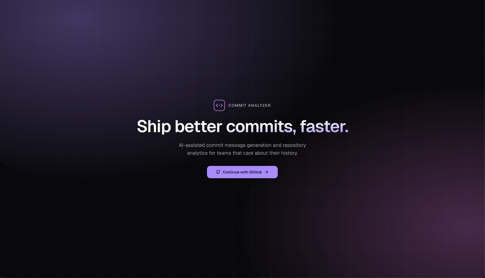                           |
| Repositories — connect        | 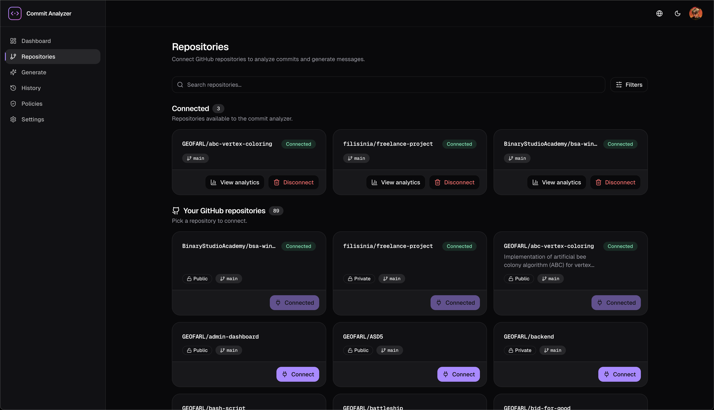                 |
| Analytics dashboard           | 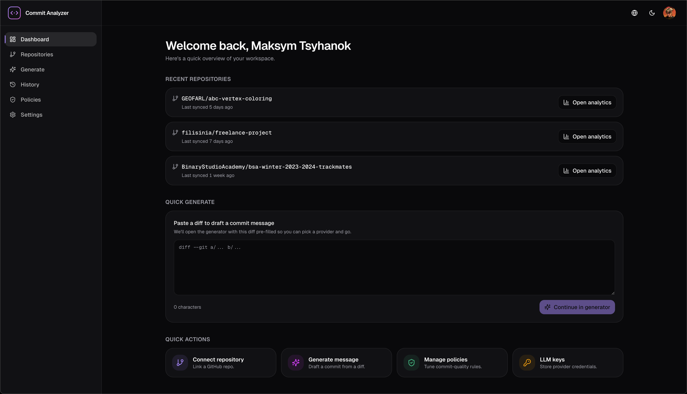                       |
| Commit timeline + heatmap     | 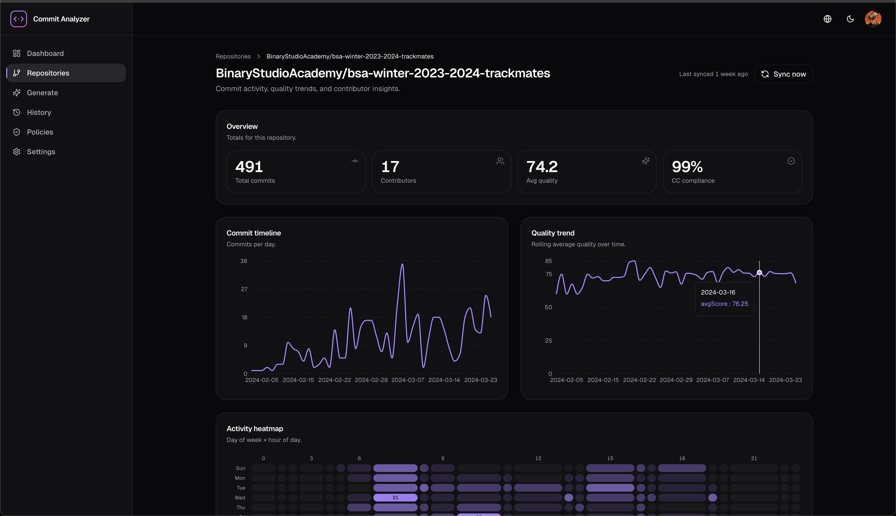               |
| Quality trends + contributors | 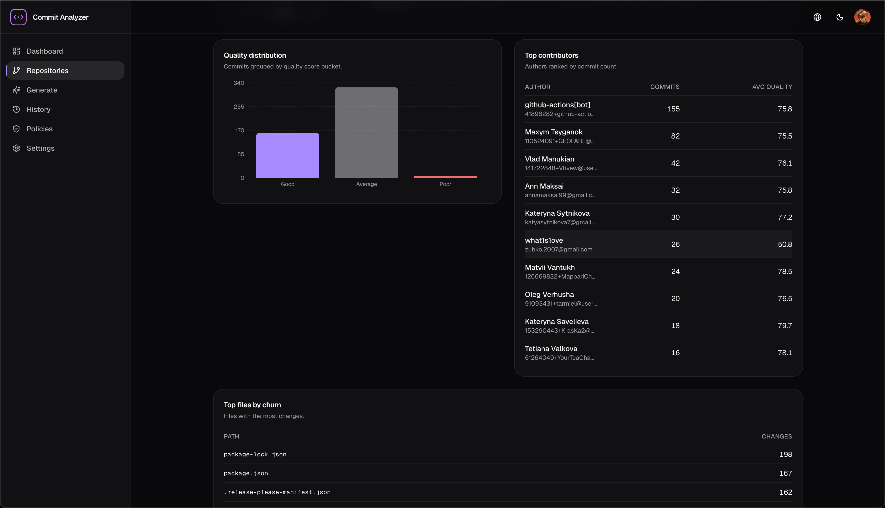             |
| Generate commit diff          | 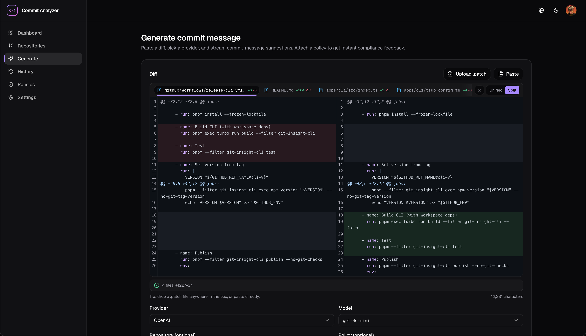 |
| Generate page (streaming)     | 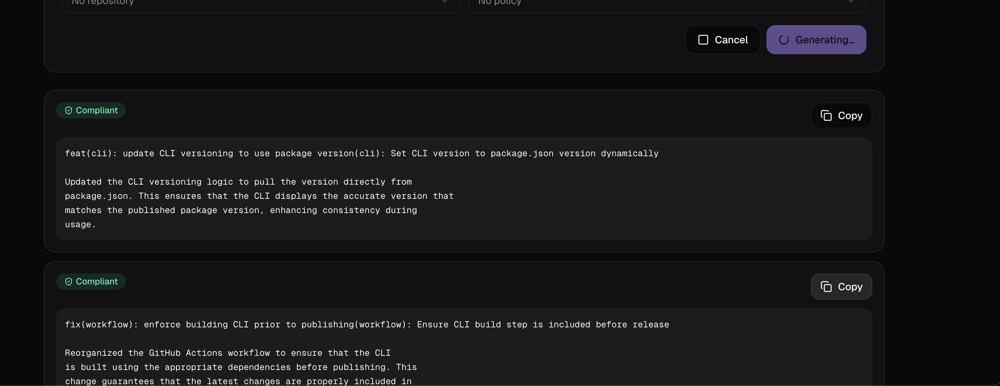        |
| Policies — list               | 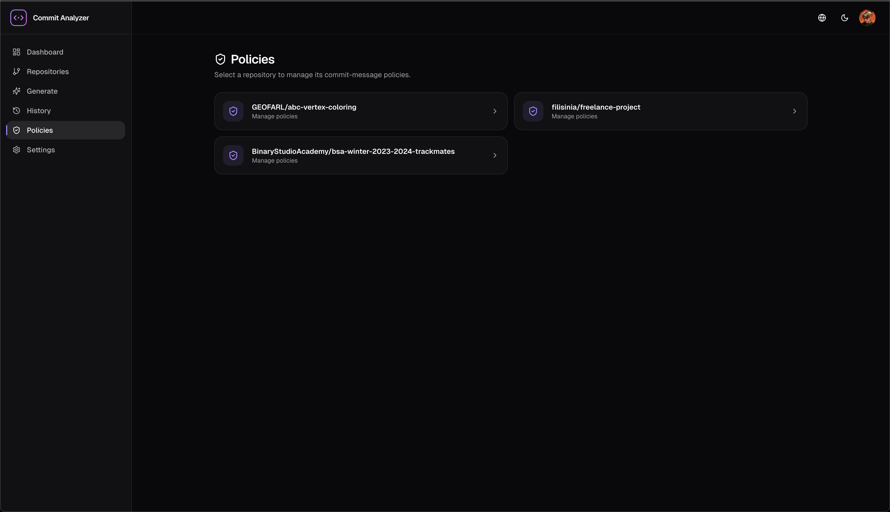               |
| Policies — list repo          | 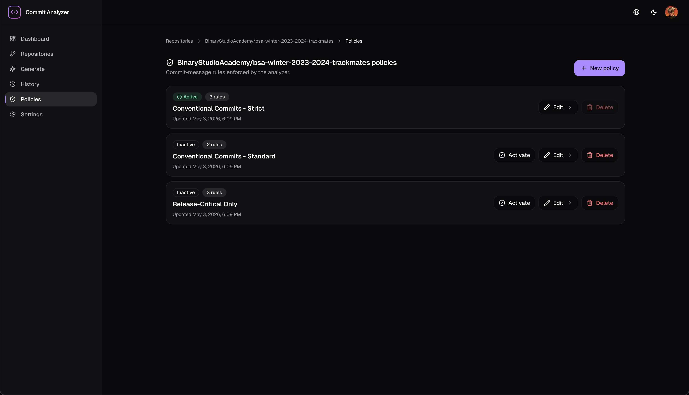     |
| Policies — visual editor      | 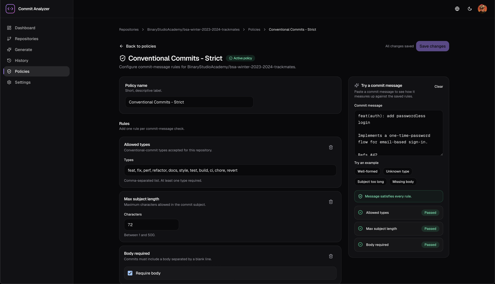      |
| Settings — LLM keys           | 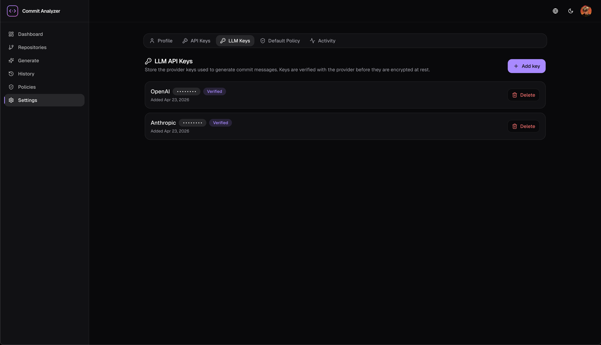                |
| Settings — CLI API keys       | 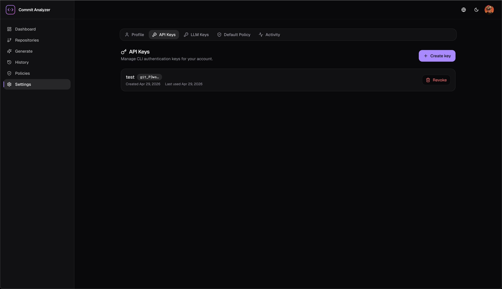            |
| Settings — activity audit log | 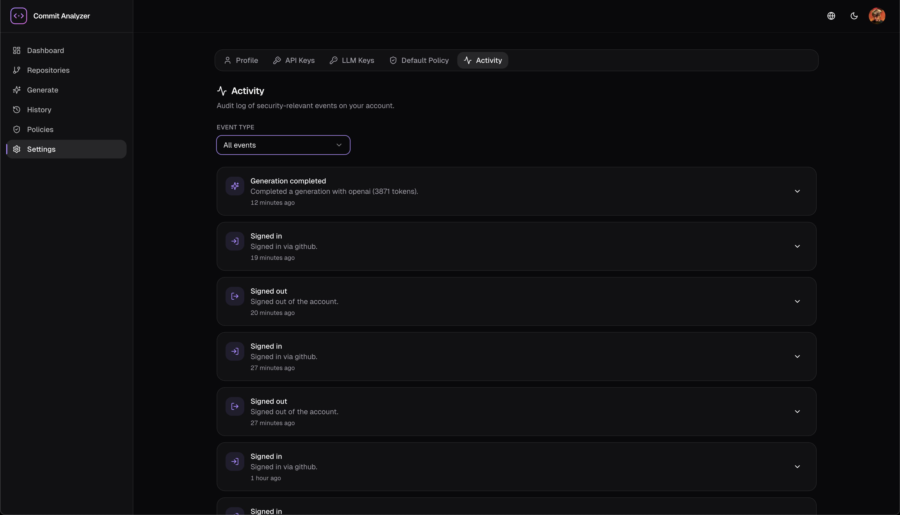              |
| CLI — `git-insight generate`  | 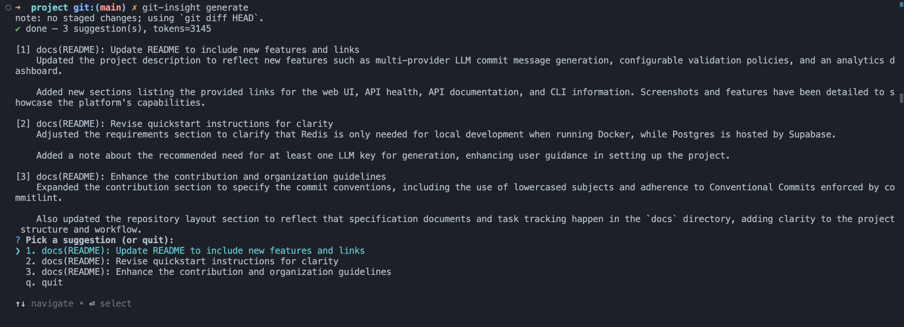         |

## Features

- **GitHub OAuth + repo connection** — Supabase Auth (PKCE, JWKS), per-user CLI API keys (argon2id-hashed, reveal-once).
- **Background sync** — BullMQ workers pull commits via Octokit (throttling + retry plugins), score quality, stream progress over Socket.IO with the Redis adapter for multi-instance fan-out.
- **Analytics dashboard** — commit timeline, contribution heatmap, contributor stats, file-change frequency, Conventional Commits quality trends, per-repo summary card. Recharts + custom SVG heatmap, Redis read-aside cache.
- **Commit message generation** — paste a diff, pick a provider (OpenAI / Anthropic via the Vercel AI SDK), get ≥3 streamed Conventional Commits suggestions in <2 s TTFT. PII is stripped from diffs before any LLM call.
- **Policy engine** — per-repo rule sets (allowed types/scopes, length, body/footer rules) edited via a visual builder. Manual validation panel; optional one-shot regeneration when a suggestion fails policy (`GENERATION_POLICY_REGEN_ENABLED`).
- **Settings** — profile, default policy template, encrypted LLM keys with verification probe, CLI API key management, activity audit log.
- **CLI** — `configure`, `generate` (with `--commit` and `--copy`), `whoami`, `keys list`. Shares the ts-rest contract package with the web app, so types never drift. Published to npm on `cli-v*` tags.
- **Internationalisation** — UA + EN via `next-intl`, message catalogs validated in CI.
- **Accessibility** — Playwright + axe-core a11y audit gates serious violations at zero.
- **Performance** — Lighthouse CI workflow with budgets.
- **Security** — RLS on every user-owned table (per-tx `SET LOCAL request.jwt.claims`), AES-256-GCM at rest for tokens/keys, strict CSP (Scalar CDN allowance is scoped to `/api/docs`), helmet, rate limiting via `@nestjs/throttler`.

## Stack

Turborepo + pnpm workspaces · Next.js 16 (App Router, React 19.2) · NestJS 11 (CQRS) · TypeORM · Supabase Postgres 16 + Auth + RLS · Redis 7 · BullMQ · Socket.IO · ts-rest + Zod · Vercel AI SDK · Tailwind CSS 4 + shadcn/ui · Recharts · Commander.js · Vitest · Playwright · axe-core · Lighthouse CI.

## Repository layout

```
apps/
  api/   NestJS API + BullMQ workers + Socket.IO gateway
  web/   Next.js 16 App Router (App + dashboard + settings + marketing)
  cli/   git-insight-cli (Commander.js)
packages/
  contracts/        ts-rest contracts (Zod-typed, shared FE/BE/CLI)
  database/         TypeORM entities + migrations
  diff-parser/      diff parse + PII strip + truncate
  shared-types/     cross-cutting types
  eslint-config/    flat ESLint preset
  typescript-config/ tsconfig presets
docs/    architecture, ADRs, API contracts, module specs, roadmap
tests/   load (k6) + cross-app integration
```

## Quickstart

Requires Node 20+, pnpm 9.12+, Docker (Redis only — Postgres is hosted by Supabase), and a Supabase account.

### 1. Provision a dev Supabase project

Local dev must NOT point at the prod Supabase project — every migration or destructive query would hit real user data. Create a separate free-tier project (e.g. `commit-analyzer-dev`) and capture:

- Project URL: `https://<ref>.supabase.co`
- Publishable (anon) key and service role key: Dashboard → Settings → API
- Transaction pooler connection string (port 6543): Dashboard → Settings → Database

### 2. Register a dev GitHub OAuth app

Create a dedicated OAuth app at <https://github.com/settings/developers> with:

- Homepage URL: `http://localhost:3000`
- Authorization callback URL: `http://localhost:3000/auth/callback`

Keep the prod OAuth app separate so rotating one doesn't break the other.

### 3. Bootstrap env files

```bash
cp .env.example apps/api/.env
cp .env.example apps/web/.env.local   # only the NEXT_PUBLIC_* keys are read here
```

Fill in the values from steps 1–2, then generate a fresh encryption key (do **not** reuse prod's — it would let prod-encrypted rows decrypt in dev):

```bash
openssl rand -base64 32   # paste into ENCRYPTION_KEY_BASE64 in apps/api/.env
```

At least one LLM key (`OPENAI_API_KEY` or `ANTHROPIC_API_KEY`) is recommended for the generation flow.

### 4. Run schema migrations against dev

```bash
cd packages/database
DATABASE_URL="<dev pooler connection string>" DATABASE_SSL=true pnpm migration:run
```

### 5. Boot the stack

```bash
pnpm install
docker compose up -d   # Redis only
pnpm dev
```

Web runs on <http://localhost:3000>, API on <http://localhost:4000>, OpenAPI docs on <http://localhost:4000/api/docs>.

## CLI

```bash
npm i -g git-insight-cli
git-insight configure      # paste API URL + CLI key from web Settings → API Keys
git-insight generate       # generate from staged changes
git-insight generate --pr  # generate a PR summary from the current branch
git-insight generate --commit   # auto-commit the chosen suggestion
```

`git-insight` is an alias for `git-insight-cli`. Config lives in `.git-insightrc` (JSON / YAML / JS) discovered upward from cwd.

## Scripts

```bash
pnpm dev         # turbo run dev   (api + web + watchers)
pnpm build       # turbo run build
pnpm test        # turbo run test  (Vitest across packages)
pnpm lint        # turbo run lint
pnpm typecheck   # turbo run typecheck
pnpm format      # prettier --write
pnpm knip        # unused-export audit

# web app
pnpm --filter @commit-analyzer/web e2e         # Playwright
pnpm --filter @commit-analyzer/web lh:full     # Lighthouse build + audit
```

## Development

See [CONTRIBUTING.md](./CONTRIBUTING.md) for commit conventions (lowercase ≤50-char subjects, Conventional Commits, enforced by commitlint) and branch naming (`<type>/T-<x.y>-<slug>`, enforced by CI).

Specification documents live in [`docs/`](./docs): requirements, global architecture, per-module specs, API contracts, ADRs, and the phase-by-phase roadmap. Tasks are tracked as GitHub issues grouped by phase milestones.

## Deployment

Continuous deployment runs from `main` via GitHub Actions:

- `deploy-web` — Vercel (triggered on `apps/web/**`, `packages/**`)
- `deploy-api` — Railway (triggered on `apps/api/**`, `packages/**`)
- `release-cli` — npm publish on `cli-v*` tags (provenance enabled)

Each workflow logs a skip notice and exits green when its secrets are absent, so the pipeline stays non-blocking until infra is provisioned.

Required repository secrets:

| Workflow      | Secrets                                              |
| ------------- | ---------------------------------------------------- |
| `deploy-web`  | `VERCEL_TOKEN`, `VERCEL_ORG_ID`, `VERCEL_PROJECT_ID` |
| `deploy-api`  | `RAILWAY_API_TOKEN`, `RAILWAY_SERVICE_ID_API`        |
| `release-cli` | `NPM_TOKEN`                                          |

Health checks are driven by repository variables (not secrets):

| Variable         | Example                                                |
| ---------------- | ------------------------------------------------------ |
| `WEB_HEALTH_URL` | `https://commit-analyzer.vercel.app/`                  |
| `API_HEALTH_URL` | `https://poetic-luck-production.up.railway.app/health` |
